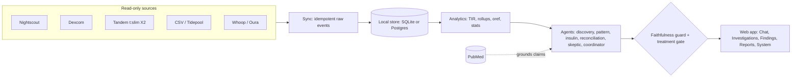
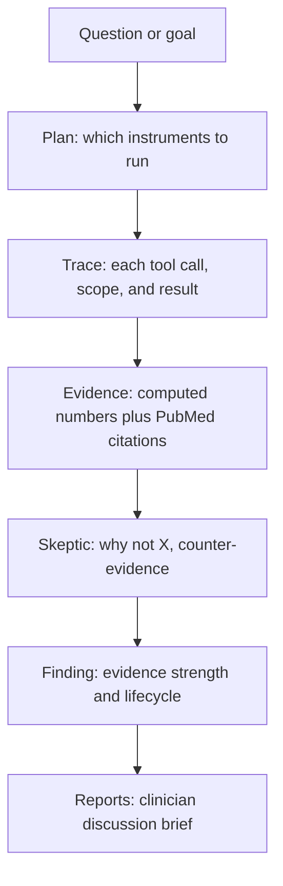

# dexta-intelligence

[](https://github.com/IshaanRSharma/dexta-intelligence/actions/workflows/ci.yml)
[](LICENSE)
[](pyproject.toml)

Continuous, evidence-grounded intelligence for Type 1 diabetes data. dexta is a self-hosted
agentic harness that turns your CGM, insulin, pump, and wearable history into traceable findings:
why something happened, what changed, and what the system has learned over months of your data.

Bring your own model. Bring your own database. Your data never leaves your infrastructure.

> Not a medical device. dexta never gives dosing advice. It surfaces patterns and evidence for you
> and your care team to review. Every finding is a hypothesis, not a prescription. See
> [MEDICAL_DISCLAIMER.md](MEDICAL_DISCLAIMER.md) and [PRIVACY.md](PRIVACY.md).

## What makes it different

Most diabetes tools show you what happened. dexta investigates why, shows its work, and stays
honest about it. Three principles:

1. Determinism computes the facts, the model reasons on top. Tested analytics and statistics
   produce every number (time in range, rigor gates, oref reconciliation). The model plans
   investigations, ranks hypotheses, and explains. It never invents a figure.
2. Statistical rigor before any claim. Discovery agents must pass permutation tests and
   false-discovery control, then survive an independent skeptic, before a finding is shown.
3. Two hard safety rails. A faithfulness guard rejects any prose whose numbers do not trace to a
   tool call. A treatment gate blocks dosing, basal, carb-ratio, and correction instructions. Always.

## Quickstart

One command, just Docker, no data or API key:

```bash
docker compose up demo      # builds, seeds a synthetic patient, serves http://localhost:8787
```

Or from a source checkout:

```bash
pip install -e ".[gui,llm]"

dexta serve --demo          # seed a synthetic patient (if empty) and open the web app
dexta demo                  # or: run one investigation end to end in the terminal, no key needed
```

`dexta demo` / `--demo` is the fastest way to see it: it loads ~90 days of a realistic Tandem t:slim X2
patient (CGM, boluses, Control-IQ basals, carb entries, two profile versions, logged forecast
curves, manual notes) with a planted, explainable dinner-spike, then explains it with a visible
plan and trace.

## Architecture



Layers, bottom to top:

- Connectors pull provider records as immutable raw events. Read-only by default. Idempotent, so
  re-syncing is always safe.
- A storage port (SQLite for zero-setup, Postgres for production) holds raw events, a normalized
  clinical timeline, rollups, and agent memory (findings, hypotheses, runs).
- Analytics and statistics compute the facts: time in range, coefficient of variation, oref0
  IOB and COB and forecast reconciliation, permutation tests, FDR control, error grids.
- Agents reason over that evidence. Deterministic producers run rigor-gated pattern tests. The
  coordinator plans which to run. An LLM orchestrator drills single questions tool by tool. An
  adversarial skeptic re-checks every finding.
- Two rails bound the output, then the web app renders the plan, trace, evidence, and findings.

## The investigation flow



Every serious answer carries a visible plan, a tool-by-tool trace, the evidence behind it, the
competing hypotheses, and what could not be checked.

## Features

The web app is one clear feature per tab:

| Tab | What it does |
| --- | --- |
| Chat | Instant question and answer with a live tool trace. |
| Investigations | The deep, traced drill: plan to trace to evidence, plus deep analysis and the open-investigations queue. |
| Findings | Durable memory: active, hypotheses, rejected, and the investigation log, with evidence strength and counter-evidence. Prediction reconciliation lives here. |
| Reports | A clinician discussion brief (review now, monitor, questions to ask), grounded in your evidence and PubMed, with Markdown export. |
| Goals | Goals run as recurring investigations, with progress and checkpoints. |
| Connectors | Data sources, per-source health, and continuous sync. |
| System | Observability and the evaluation model card. |
| Settings | Configuration. |

Manual context ("+ Log context") is reachable from the Dashboard and Investigations.

## Data and connectors

dexta ingests, read-only, and stores locally:

- CGM (Nightscout, Dexcom, LibreLinkUp, CSV exports, Tidepool).
- Insulin and pump data, including Tandem t:slim X2 and Control-IQ (boluses, temp basals, suspends,
  and the basal, carb-ratio, and ISF profile, versioned over time).
- Carb entries, sleep and activity (Whoop, Oura), and logged forecast curves (OpenAPS, AAPS, Loop).
- User-reported manual context (meals, stress, site changes, notes).

Nothing is written back to any device or service. Synced data persists in a local SQLite database
(`~/.dexta/dexta.db`) or a Postgres instance you control.

## Evaluation and safety

dexta ships a reproducible eval harness with synthetic ground truth. Run any of these:

| Eval | Measures | Reproduce |
| --- | --- | --- |
| E1 faithfulness | the guard catches fabricated or miscontextualized numbers | `python -m eval.runner e1` |
| E2 power | true-discovery rate on a planted effect | `python -m eval.runner e2` |
| E3 accuracy | oref0 forecast vs realized glucose (Clarke and Parkes error grid, MARD) | `python -m eval.runner e3` |
| E4 null FDR | empirical false-discovery rate on effect-free data | `python -m eval.runner e4-null` |
| E5 perturbation | finding-set stability under dropout, dupes, gaps, timezone shift | `python -m eval.runner e5` |
| E_consensus | rollup metrics match the 2019 international-consensus formulas | `python -m eval.runner consensus` |
| E6 agentic | end-to-end attribution, faithfulness, and a dosing-advice red team (target zero) | `python -m eval.runner e6` |

These are calibration and robustness checks on synthetic data, not clinical validation. E6 needs a
model provider; the rest run without a key. The web app surfaces a live model card and a dosing
safety scan at `/evals`. For the deeper design, see [TECHNICAL_REPORT.md](guide/TECHNICAL_REPORT.md).

## Running

```bash
dexta serve                 # web app (add --sync-every 15 for in-app background sync)
dexta sync                  # pull configured connectors once
dexta ask "why are my mornings high?"   # one investigation from the CLI
dexta investigate           # whole-record deep analysis
dexta monitor               # deterministic anomaly scan
dexta daemon                # continuous sync, monitor, goal ticks, periodic deep analysis
```

A language model unlocks the reasoning layer. Set a provider in Settings (or `dexta.toml`) and an
API key in your environment. Without one, the deterministic analytics, stats, and monitors still run.

## Testing

```bash
.venv/bin/ruff check src/ tests/ eval/
.venv/bin/mypy src/dexta_intelligence/
.venv/bin/pytest
```

Line length 100, mypy strict, tests for new behavior.

## Extending

Adding a connector, an analysis agent, or a tool the reasoning loop can call is a small, local
change. See [EXTENDING.md](guide/EXTENDING.md) for minimal recipes, each backed by a conformance test,
and [TECHNICAL_REPORT.md](guide/TECHNICAL_REPORT.md) for the deeper design.

## Disclaimer

dexta is observation and discussion support, not a medical device, and never produces dosing
advice. See [MEDICAL_DISCLAIMER.md](MEDICAL_DISCLAIMER.md), [PRIVACY.md](PRIVACY.md),
[SECURITY.md](SECURITY.md), and [CONTRIBUTING.md](CONTRIBUTING.md).
