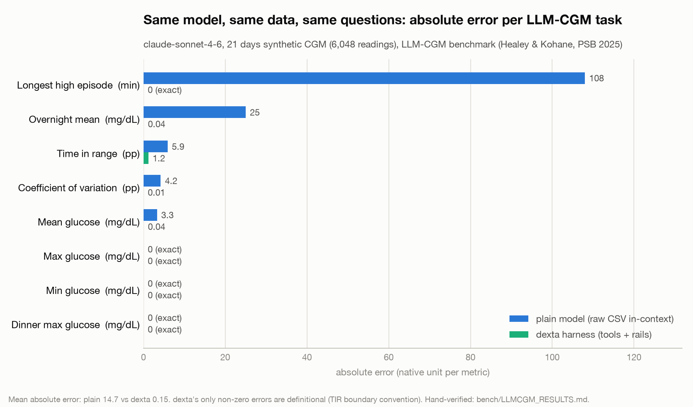
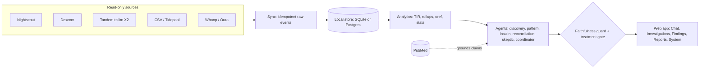
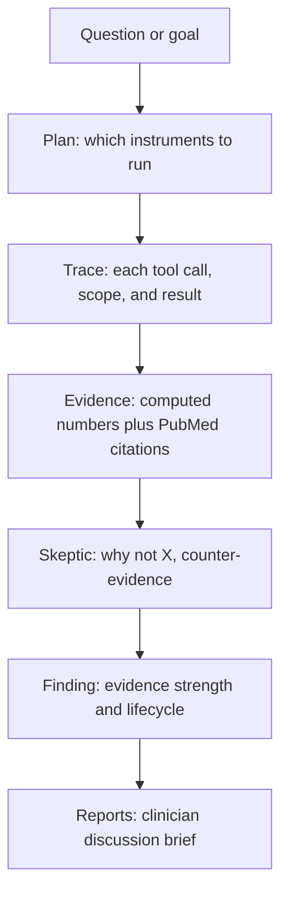

# dexta-intelligence

[](https://github.com/IshaanRSharma/dexta-intelligence/actions/workflows/ci.yml)
[](LICENSE)
[](pyproject.toml)

Continuous, evidence-grounded intelligence for Type 1 diabetes data. dexta is a self-hosted
agentic harness that turns your CGM, insulin, pump, and wearable history into traceable findings:
why something happened, what changed, and what the system has learned over months of your data.

Bring your own model. Bring your own database. Your data never leaves your infrastructure.

> Not a medical device. dexta never gives dosing advice. It surfaces patterns and evidence for you
> and your care team to review. Every finding is a hypothesis, not a prescription. See
> [MEDICAL_DISCLAIMER.md](MEDICAL_DISCLAIMER.md) and [PRIVACY.md](PRIVACY.md).

## What makes it different

Most diabetes tools show you what happened. dexta investigates why, shows its work, and stays
honest about it. Three principles:

1. Determinism computes the facts, the model reasons on top. Tested analytics and statistics
   produce every number (time in range, the clinician-anchored Glycemia Risk Index, rigor gates,
   oref reconciliation). The model plans investigations, ranks hypotheses, and explains. It never
   invents a figure.
2. Statistical rigor before any claim. Discovery agents must pass permutation tests and
   false-discovery control, then survive an independent skeptic, before a finding is shown.
3. Two hard safety rails. A faithfulness guard rejects any prose whose numbers do not trace to a
   tool call. A treatment gate blocks dosing, basal, carb-ratio, and correction instructions. Always.

## External benchmark

Why the harness matters, measured. Same model (`claude-sonnet-4-6`), same 21-day CGM record
(6,048 readings), same questions from the peer-reviewed LLM-CGM benchmark
([Healey & Kohane, PSB 2025](https://doi.org/10.1142/9789819807024_0007)). The plain model gets the
complete raw data in-context; dexta computes through its tools.



The plain model confidently narrates computation it cannot do and tells the patient their
overnight average is 25 mg/dL lower than it is. dexta's every number traces to a tool call:
mean absolute error **14.7 vs 0.15 (~100x lower)**, every well-defined statistic exact. On the
14-question subset its only non-exact answers are two genuine interpretation differences and one
principled decline (it refused to fabricate a hypoglycemia-episode count the benchmark defines by
counting every 5-minute dip, and said so). That confident, plausible, untraceable error is exactly
what the faithfulness rail exists to prevent.

Scope, stated plainly: synthetic data, one patient, single pass, 14 of 30 tasks. A controlled
probe, not a clinical claim. Scripts, raw dumps, hand-verified tables, and the honest negatives
are all in [bench/](bench/README.md).

## Quickstart: run the demo

The demo is the whole product on a synthetic patient. **No data, no API key, no account, no
clone.** If you have Docker, this is the entire setup:

```bash
docker run --rm -p 8787:8787 ghcr.io/ishaanrsharma/dexta-intelligence \
  dexta --db /tmp/demo.db serve --demo --host 0.0.0.0 --port 8787
```

Open **http://localhost:8787**. The image is multi-arch (amd64/arm64) and `--rm` throws the demo
database away when you stop it with Ctrl-C.

Prefer no Docker? From a source checkout:

```bash
pip install -e ".[gui,llm]"
dexta serve --demo          # seeds the synthetic patient into an empty database, serves the web app
dexta demo                  # or: one investigation end to end in the terminal, nothing to open
```

`dexta demo` prints a complete investigation, plan through trace to finding, in about two seconds.
It is the fastest way to see what the harness does without leaving the terminal.

### What gets seeded

`--demo` seeds a store *only if it is empty*, so restarting reuses what it already made and never
touches real data. It is deliberately isolated: throwaway database, connector sync disabled.

The record is one synthetic Tandem t:slim X2 / Control-IQ patient, **2025-12-15 to 2026-06-17**
(185 days, 53,261 CGM readings at 5-minute spacing):

| Stream | What's there |
| --- | --- |
| CGM | 53,261 readings. 76% time in range, 2.6% below, 22% above, CV 32%, GMI 6.9% |
| Insulin | 1,573 events: meal boluses, Control-IQ temp basals, automatic corrections, low-glucose suspends |
| Carbs | 569 entries across breakfast, lunch, and dinner |
| Sleep / activity | 184 scored nights, 94 workouts |
| Therapy profiles | 2 versions (a winter-to-spring sensitivity change mid-record) |
| Forecast curves | 12 logged oref COB/UAM curves, so prediction reconciliation has real material |
| Manual context | 3 user-reported notes (a high-fat dinner, a stressful day, a site change) |

The glucose trace is generated *from* that record rather than beside it: carbs push it up, damped
by how promptly the bolus landed, and corrections and workouts pull it down. So the causes are
really there to be found, and the variability is a real patient's, not a flat line with noise on it.

### A five-minute tour

1. **Timeline** shows the temporal episode graph: every high, low, and sensor gap as a node.
   Click any one to see the meals, boluses, and activity around it with their real offsets.
2. **Chat**: ask *"why did I spike on March 14?"*. The planted story is a dinner bolused 22 minutes
   late. Watch the tool trace build the answer.
3. **Investigations**: run the deep pass. Plan, then trace, then evidence, then the skeptic.
4. **Findings** and **Reports** hold what survived, with evidence strength and counter-evidence.

Chat and the tool-by-tool drill-down need a model (see [Running](#running)). The Timeline, the
deterministic deep analysis, and the findings it produces need no key at all.

### Building from a clone instead

```bash
docker compose up demo      # builds your working tree, seeds, serves http://localhost:8787
```

The first run builds the image and takes a few minutes; later runs start in seconds and reuse the
database seeded the first time. To start over from an empty one:

```bash
docker compose rm -sf demo && docker volume rm dexta-intelligence_dexta_demo
```

### Moving on to your own data

Nothing carries over from the demo, by design. Point dexta at a fresh database and connect a
source in the **Connectors** tab (or `dexta sync`):

```bash
dexta --db ~/.dexta/dexta.db serve
```

## Architecture


```mermaid
flowchart LR
  subgraph Sources [Read-only sources]
    NS[Nightscout]
    DEX[Dexcom]
    TAN[Tandem t:slim X2]
    CSV[CSV / Tidepool]
    WEAR[Whoop / Oura]
  end
  Sources --> SYNC[Sync: idempotent raw events]
  SYNC --> STORE[(Local store: SQLite or Postgres)]
  STORE --> AN[Analytics: TIR, rollups, oref, stats]
  AN --> AG[Agents: discovery, pattern, insulin, reconciliation, skeptic, coordinator]
  LIT[(PubMed)] -. grounds claims .-> AG
  AG --> RAILS{Faithfulness guard + treatment gate}
  RAILS --> UI[Web app: Chat, Investigations, Findings, Reports, System]
```

Layers, bottom to top:

- Connectors pull provider records as immutable raw events. Read-only by default. Idempotent, so
  re-syncing is always safe.
- A storage port (SQLite for zero-setup, Postgres for production) holds raw events, a normalized
  clinical timeline, rollups, and agent memory (findings, hypotheses, runs).
- Analytics and statistics compute the facts: time in range, coefficient of variation, oref0
  IOB and COB and forecast reconciliation, permutation tests, FDR control, error grids.
- Agents reason over that evidence. Deterministic producers run rigor-gated pattern tests. The
  coordinator plans which to run. An LLM orchestrator drills single questions tool by tool. An
  adversarial skeptic re-checks every finding.
- Two rails bound the output, then the web app renders the plan, trace, evidence, and findings.

## The investigation flow


```mermaid
flowchart TD
  Q[Question or goal] --> P[Plan: which instruments to run]
  P --> T[Trace: each tool call, scope, and result]
  T --> E[Evidence: computed numbers plus PubMed citations]
  E --> S[Skeptic: why not X, counter-evidence]
  S --> F[Finding: evidence strength and lifecycle]
  F --> R[Reports: clinician discussion brief]
```

Every serious answer carries a visible plan, a tool-by-tool trace, the evidence behind it, the
competing hypotheses, and what could not be checked.

## The temporal episode graph

Raw CGM data is thousands of readings, one every five minutes. Language models are measurably bad
at reasoning over that directly: they miscount episodes, misjudge how long a low lasted, and invent
trends (this is exactly the failure the benchmark above measures). dexta never asks the model to.
A deterministic pass first segments the raw trace into a small, addressable graph of the things a
clinician actually talks about:

- **Episode nodes** are each contiguous low (< 70 mg/dL), high (> 180), or sensor gap, with its
  span, nadir or peak, duration, and severity. The cut points are the 2019 international consensus
  (Battelino et al., Diabetes Care), including its two-sided event rule: an excursion starts on
  crossing a threshold and does not end until readings are back in range for 15 minutes. Both
  halves matter, because without the second a trace bobbing around 180 for an afternoon segments
  into a dozen "episodes" and every count built on them measures sensor noise. A run never
  silently spans a sensor gap, so a reported duration is always time the sensor was watching.
- **Context edges** tie each episode to the meals, boluses, activity, and sleep around it, each with
  a signed offset ("45 g carbs, 20 min before"). A carb entry and the bolus for it fold into one
  "treatment" edge.
- **Chain edges** link consecutive episodes that sit within three hours and name the shape of the
  sequence: `rebound_after_low` (a low, rescue carbs, then a high), `low_after_high`, or a weaker
  `follows`. These describe the geometry, never assign blame, and are never claimed across a sensor
  gap where the trajectory is unobserved.

This one segmentation is the single source of truth the whole system reasons over. Chat traverses
it to answer "why did I go high then", goals track episode counts, the background producers and the
curiosity daemon surface recurring patterns from it, and the Timeline draws it. Every episode number
in an answer or on screen comes from this graph, with no model in the counting.

Because the model reads this graph rather than the trace, the graph is what has to refuse to
mislead it. Three properties do that work:

- **A clipped episode says so.** One that was already underway when the window opened, or still
  underway when it closed, is flagged, and its duration is reported as a lower bound. The same
  physiological run would otherwise report a different length under a differently aligned window.
- **Counts carry their denominator.** Every summary reports how much of the window the sensor was
  actually watching, so "two lows this month" cannot read the same whether the sensor ran for
  thirty days or three.
- **A miss is a miss.** Asking what happened at a moment when nothing was happening returns exactly
  that, and names the nearest episode as a separate fact, rather than handing back an excursion
  seven hours away for the model to explain as though it were the answer.

## Features

The web app is one clear feature per tab:

| Tab | What it does |
| --- | --- |
| Chat | Instant question and answer with a live tool trace. |
| Timeline | A focus-plus-context view of the temporal episode graph. A navigator strip places every high, low, and sensor gap on the time axis; selecting one opens a relation view with two lenses: Curve draws the local glucose trace with each meal, bolus, activity, and sleep placed at its real time and labelled with its relation to the episode ("meal 45g, 27 min before"), and Graph renders the same relations as a deterministic node-link ego-graph. Prev/next and keyboard navigation, filters by kind, both themes. Every number comes from the deterministic episode graph, no model in the drawing. |
| Investigations | The deep, traced drill: plan to trace to evidence, plus deep analysis and the open-investigations queue. |
| Findings | Durable memory: active, hypotheses, rejected, and the investigation log, with evidence strength and counter-evidence. Prediction reconciliation lives here. |
| Reports | A clinician discussion brief (review now, monitor, questions to ask), grounded in your evidence and PubMed, with Markdown export. |
| Goals | Goals run as recurring investigations, with progress and checkpoints. |
| Connectors | Data sources, per-source health, and continuous sync. |
| System | Observability and the evaluation model card. |
| Settings | Configuration. |

Manual context ("+ Log context") is reachable from the Dashboard and Investigations.

## Data and connectors

dexta ingests, read-only, and stores locally:

- CGM (Nightscout, Dexcom, LibreLinkUp, CSV exports, Tidepool).
- Insulin and pump data, including Tandem t:slim X2 and Control-IQ (boluses, temp basals, suspends,
  and the basal, carb-ratio, and ISF profile, versioned over time).
- Carb entries, sleep and activity (Whoop, Oura), and logged forecast curves (OpenAPS, AAPS, Loop).
- User-reported manual context (meals, stress, site changes, notes).

Nothing is written back to any device or service. Synced data persists in a local SQLite database
(`~/.dexta/dexta.db`) or a Postgres instance you control.

## Evaluation and safety

dexta ships a reproducible eval harness with synthetic ground truth. Run any of these:

| Eval | Measures | Reproduce |
| --- | --- | --- |
| E1 faithfulness | the guard catches fabricated or miscontextualized numbers | `python -m eval.runner e1` |
| E2 power | true-discovery rate on a planted effect | `python -m eval.runner e2` |
| E3 accuracy | oref0 forecast vs realized glucose (Clarke and Parkes error grid, MARD) | `python -m eval.runner e3` |
| E4 null FDR | empirical false-discovery rate on effect-free data | `python -m eval.runner e4-null` |
| E5 perturbation | finding-set stability under dropout, dupes, gaps, timezone shift | `python -m eval.runner e5` |
| E_consensus | rollup metrics match the 2019 international-consensus formulas | `python -m eval.runner consensus` |
| E6 agentic | end-to-end attribution, faithfulness, and a dosing-advice red team (target zero) | `python -m eval.runner e6` |

These are calibration and robustness checks on synthetic data, not clinical validation. E6 needs a
model provider; the rest run without a key. The web app surfaces a live model card and a dosing
safety scan at `/evals`. For the deeper design, see [TECHNICAL_REPORT.md](guide/TECHNICAL_REPORT.md).

## Running

```bash
dexta serve                 # web app (add --sync-every 15 for in-app background sync)
dexta sync                  # pull configured connectors once
dexta ask "why are my mornings high?"   # one investigation from the CLI
dexta investigate           # whole-record deep analysis
dexta monitor               # deterministic anomaly scan
dexta daemon                # continuous sync, monitor, goal ticks, periodic deep analysis
```

A language model unlocks the reasoning layer. Set a provider in Settings (or `dexta.toml`) and an
API key in your environment. Without one, the deterministic analytics, stats, and monitors still run.

## Testing

```bash
.venv/bin/ruff check src/ tests/ eval/ bench/
.venv/bin/mypy src/dexta_intelligence/
.venv/bin/pytest
```

Line length 100, mypy strict, tests for new behavior.

## Extending

Adding a connector, an analysis agent, or a tool the reasoning loop can call is a small, local
change. See [EXTENDING.md](guide/EXTENDING.md) for minimal recipes, each backed by a conformance test,
and [TECHNICAL_REPORT.md](guide/TECHNICAL_REPORT.md) for the deeper design.

## Disclaimer

dexta is observation and discussion support, not a medical device, and never produces dosing
advice. See [MEDICAL_DISCLAIMER.md](MEDICAL_DISCLAIMER.md), [PRIVACY.md](PRIVACY.md),
[SECURITY.md](SECURITY.md), and [CONTRIBUTING.md](CONTRIBUTING.md).
