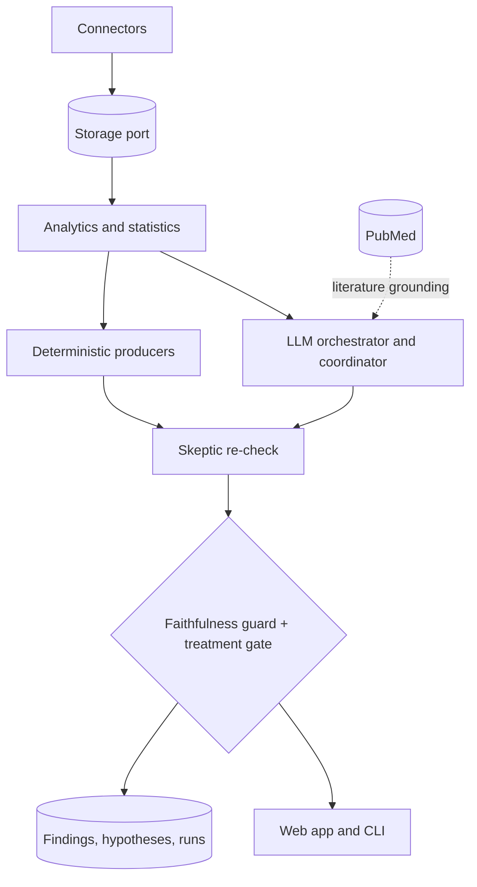

# dexta-intelligence: a technical report

dexta is an open-source, self-hosted intelligence layer for Type 1 diabetes time-series data. This
report describes the architecture, the determinism boundary that defines it, the safety model, and
how the system is evaluated. It is written for engineers and researchers assessing the design.

## 1. Problem and thesis

Diabetes generates dense multi-stream time series (CGM every five minutes, plus insulin, carbs,
pump basal, sleep, activity, and algorithm forecasts). Existing tools summarize it. They rarely
investigate why a given event happened, almost never carry that reasoning forward as durable
memory, and offer no traceable evidence path. Naively pointing a large language model at the data
produces fluent but unverifiable claims, which is unacceptable in a clinical context.

dexta's thesis: keep the model as the reasoning layer, but never let it be the source of truth.

> Deterministic analytics compute the facts. The model plans, ranks, and explains over those facts.
> Two rails bound the output. No component produces dosing advice.

This is the inverse of an autonomous clinical model. It trades raw generative ceiling for
reproducibility, traceability, and a hard safety boundary.

## 2. Architecture

Five layers, each with a narrow contract.

1. Connectors. One per source (Nightscout, Dexcom, LibreLinkUp, Tandem t:slim X2, CareLink,
   Tidepool, Whoop, Oura, CSV upload). Each implements `check` and `pull` and returns immutable
   raw events plus their normalized projections. Read-only against external systems by default.
2. Storage port. A single narrow interface with two backends: SQLite (zero setup) and Postgres
   (production). It holds raw events, the normalized clinical timeline, rollups, and agent memory.
   Idempotency is structural: raw events dedupe on `(source, source_id)`, timeline events on
   natural keys, so re-syncing with an overlap margin is always safe.
3. Analytics and statistics. Pure, tested functions: time in range and the 2019 consensus metrics,
   rollups, oref0 IOB/COB and forecast reconciliation, Clarke and Parkes error grids, and an
   inferential core (Welch t, Mann-Whitney, Cohen d, Hedges g, Cliff delta, permutation tests,
   Benjamini-Hochberg FDR, bootstrap intervals).
4. Agents. Deterministic producers run rigor-gated pattern tests. A coordinator plans which
   producers to run for a goal and composes bounded follow-up rounds. An LLM orchestrator drills a
   single question tool by tool over the full instrument belt. An adversarial skeptic re-checks
   every finding. A clinical advisory layer turns findings into clinician discussion options.
5. Rails and surfaces. The faithfulness guard and treatment gate bound every output, then the web
   app renders the plan, trace, evidence, findings, reconciliation, reports, and observability.

## 3. The determinism boundary

The boundary is the central design decision. Above it, the model decides: which investigations to
run, how to drill a question, how to rank competing explanations, how to phrase a finding. Below it,
determinism computes and gates: every statistic, every threshold, every rigor verdict, and both
safety rails.

Concretely, tools return a tuple of a public result and the guard-auditable numbers they produced.
The model reasons over the public result; the guard audits the prose against the numbers. A claim
that cites a figure the tools never produced is rejected before it reaches the user.

## 4. Statistical rigor

A pattern becomes a finding only after it survives:

- A rigor gate: a permutation test for significance with Benjamini-Hochberg false-discovery
  control across the families of comparisons an agent runs, plus a split-half replication check.
- An independent skeptic: a second pass that looks for confounds and competing explanations and can
  reject or downgrade a finding, recording counter-evidence.

Findings carry an explicit lifecycle. They are marked stale by non-recurrence (a confirmation-decay
TTL scaled by confidence and how often the pattern recurs), so an obscure one-off does not resurface
forever.

## 5. Safety model

Two rails, both deterministic and both tested:

- Faithfulness guard. Compares every number in generated prose against the evidence pool the
  reasoning actually computed. Magnitude-based comparison avoids sign false-rejects; booleans are
  excluded; all violations are reported. Numberless prose passes trivially, which is an accepted and
  documented limit.
- Treatment gate. Refuses output that reads as dosing, basal, carb-ratio, or correction advice, and
  requires that treatment context was actually inspected before a cause is named when that data
  exists. Only successful tool calls count toward coverage.

The eval harness red-teams the rails end to end (E6 safety) with a target of zero dosing-advice
violations, and the web app runs a live dosing scan over persisted findings and answers.

## 6. Evaluation

dexta treats evaluation as a first-class artifact, not an afterthought. The harness uses synthetic
ground truth (planted effects with known causes) so results are reproducible and label-backed.

| Eval | Question it answers |
| --- | --- |
| E1 faithfulness | Does the guard catch fabricated and miscontextualized numbers, without rejecting faithful prose? |
| E2 power | When a known effect is planted, does the rigor-gated agent find it? |
| E3 accuracy | How close are oref0 forecasts to realized glucose (Clarke and Parkes error grid, MARD)? |
| E4 null FDR | On effect-free data, what is the empirical false-discovery rate (target at or below the alpha)? |
| E5 perturbation | Are findings stable under dropout, duplication, sensor gaps, and timezone shift? |
| E_consensus | Do the rollup metrics exactly match the 2019 international-consensus formulas? |
| E6 agentic | End to end: does the real agent name the planted cause, stay traceable, and never give dosing advice? |

These are calibration and robustness checks on synthetic data, not clinical validation. Every result
is reproducible from `python -m eval.runner <name>`.

## 7. Prediction reconciliation

When logged algorithm forecasts exist (OpenAPS, AAPS, Loop devicestatus), or can be computed from
IOB and COB, dexta compares what the loop expected against what glucose actually did. It localizes
the divergence (cycle, horizon, signed error), attributes the likely mismatch (carb underestimate,
sensitivity shift, absorption timing) by comparing the oref curve family, and reports recurrence
across history with a permutation-tested significance. It analyzes mismatch; it never recommends a
setting change.

## 8. Literature grounding

A confirmed, non-trivial pattern can be grounded in published evidence. A PubMed backend (NCBI
E-utilities, no key required) returns real PMIDs that the reasoning cites, and the renderer turns
those citations into clickable links. This is the faithfulness principle applied to claims: just as
every number traces to a tool call, every citation traces to a retrieved article.

## 9. Clinical advisory

The advisory layer adapts the structure of Google's AMIE disease-management work (analyze, set
goals, produce a schema-constrained plan where every item is grounded) while keeping dexta's
boundary. The output is a clinician discussion brief: what to review, what to monitor, and what to
ask, with each item grounded in the patient's own findings and, where available, a guideline or
PMID. The treatment gate removes anything imperative. It is decision support for a visit, exportable
as Markdown, not a treatment recommendation.

## 10. Limitations

- Synthetic evaluation is calibration, not clinical validation. Real-world performance on diverse
  patients is unverified.
- The reasoning ceiling depends on the configured base model. dexta is a harness, not a fine-tuned
  clinical model.
- Some connectors (Tandem, CareLink) are built against unofficial provider integrations and need
  live-credential validation.
- The advisory uses single-draft generation with a hard gate, not yet the multi-draft and merge
  refinement of the source architecture.

## 11. Roadmap

- An optional, measured on-device distillation of the structured tasks, evaluated with the existing
  harness, for a private and cheap local backend.
- A versioned guideline corpus alongside PubMed for richer citation grounding.
- Multi-draft and merge refinement for the advisory, behind an explicit action.

dexta is a safe, traceable investigation layer for diabetes time-series data. The point is not that
a model can talk about glucose; it is that every claim is computed, checked, and bounded.
